<div align="center">

# 💫 GrandLine_LLM


</div>

GrandLine_LLM 是一个从零开始构建的 **类 Qwen 3 Dense架构 / Deepseek MoE架构** 大语言模型。本项目实现了完整的 LLM 研发管线，通过从模型架构手动实现到 BBPE 分词器训练、分布式预训练、SFT 以及 GRPO 强化学习对齐，最终培育出一个具有极低参数量却能流畅对话的 Chatbot。

---

<br>

## ✨ 核心特性 (Key Features)

- 🧠 **原生的 Dense 架构设计**：从底层构建大语言模型结构，包含以下核心实现：
  - **GQA (分组查询注意力)**、**SwiGLU (门控前馈神经网络)**、**MoE (混合专家机制)**。
  - **RoPE (旋转位置编码)**、**KV Cache (键值缓存加速)**、**RMS Norm (均方根归一化)**。
- 🔠 **定制化 BBPE Tokenizer**：针对项目语料从头训练 Byte-Level BPE 分词器，提供更高的中文分词效率。
- 🚀 **全链路训练体系**：
  - **Pre-training (PT)**: 大规模无监督语料知识注入。带有 **LR Warmup & Cosine Decay (学习率预热与余弦衰减)** 策略。
  - **Supervised Fine-Tuning (SFT)**: 高质量指令微调，激发指令遵循能力。
  - **CoT 思维链蒸馏 (Chain-of-Thought Distillation)**: 借助强大的前沿大模型生成包含复杂推理步骤的 CoT 数据，精炼并迁移至本项目小参数模型，使其初步具备“想后填答”的逻辑推理惯性。
  - **Reinforcement Learning (GRPO)**: 从0全手写实现了组相对策略优化 (GRPO) 训练代码，对齐人类偏好。
- ⚡ **高效稳定分布式训练**：完整实现原生 **DDP (Distributed Data Parallel)** 单机多卡分布式训练，且支持完全无损的断点续训 (Lossless Checkpoint Resuming)。
- 📊 **多维评测体系**：内置标准的 Benchmark 评测管线，并引入前沿的 **LLM-as-a-Judge** 自动化评估机制。

---

<br>

## 🏗️ 架构概览与训练流程 (Architecture & Pipeline)

### 模型结构图
**类 Qwen 3 Dense 架构**
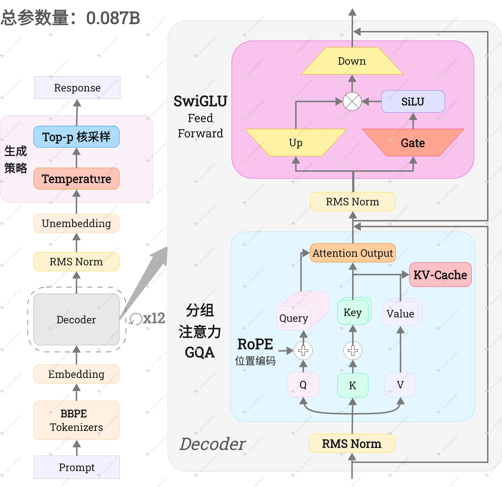

- **参数规模**: 87M (0.087B)
- **架构类型**: Causal Decoder-only (Dense Architecture)
- **并行策略**: Distributed Data Parallel (DDP) / 混合精度训练 (AMP)

---

<br>

**Deepseek MoE 架构**
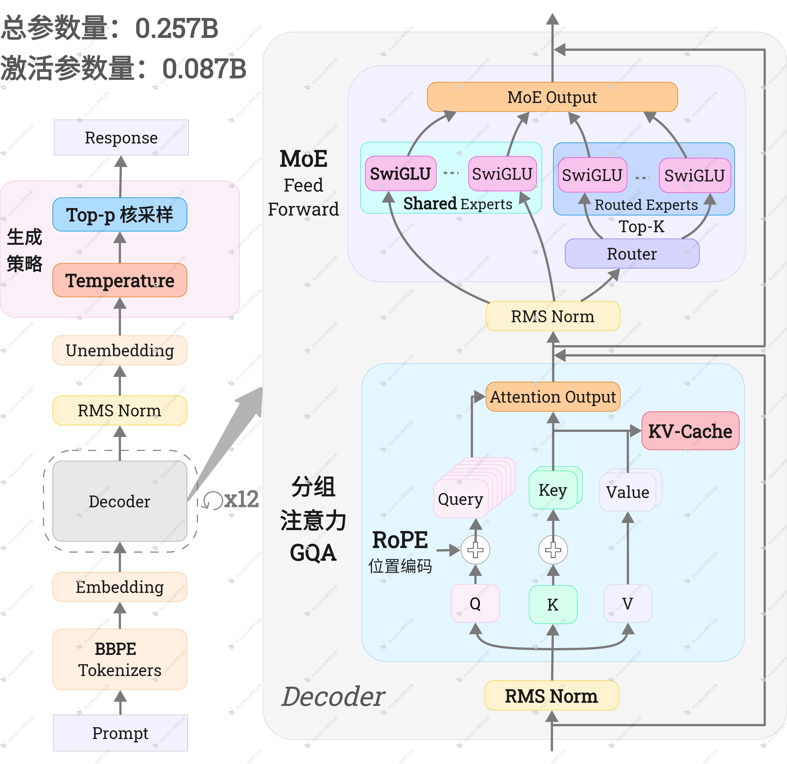


- **总参数量**: 257M(0.257B)
- **激活参数量**: 87M (0.087B)
- **架构类型**: Causal Decoder-only (MoE Architecture)
- **并行策略**: Distributed Data Parallel (DDP) / 混合精度训练 (AMP)

---

<br>

### 全链路训练流程
1. **PT (预训练)**: 通过大规模无监督语料注入语言常识，模型具备了连贯的中文续写能力。
2. **SFT (指令微调)**: 通过优质问答对微调，模型能够听懂指令并以 Assistant 的身份执行结构化回复。
3. **CoT (思维链蒸馏)**: 引入 `<think>` 标签，使极小参数模型获得了通过拆解步骤解决复杂问题的能力。
4. **GRPO (强化学习)**: 结合 LLM-as-Judge 与规则格式约束进行本地强化学习，大幅降低虚假幻觉，人类偏好对齐度显著提升。

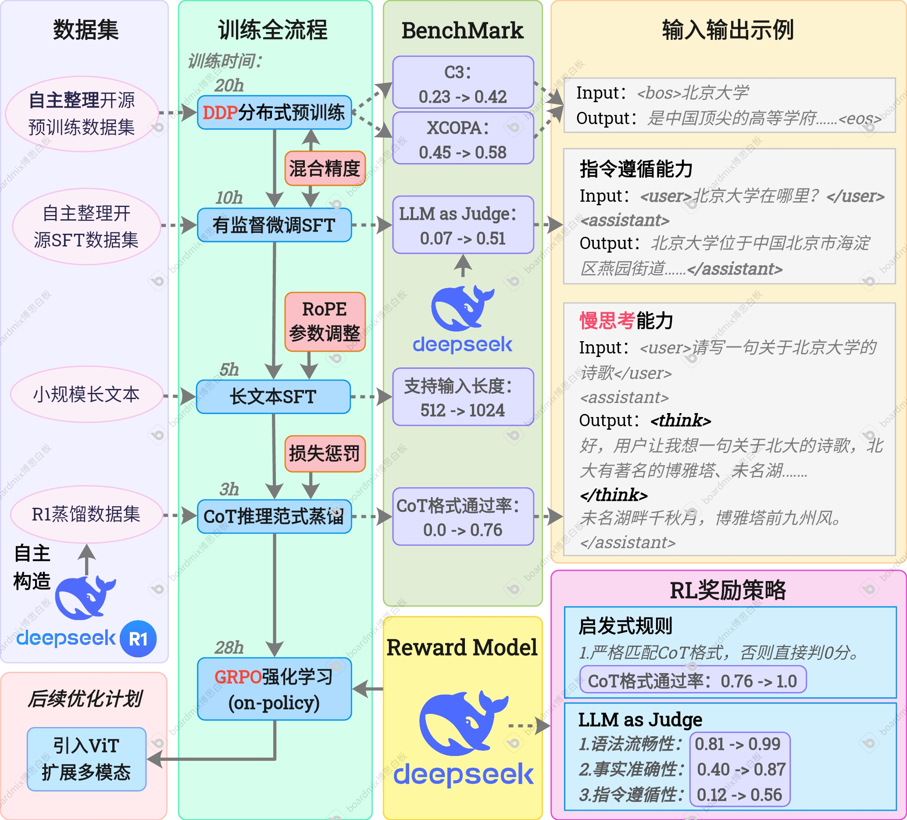

---

<br>

## 🔠 Tokenizer 配置 (Tokenizer Config)

<details>
<summary>点击查看 Tokenizer Config 信息</summary>

```json
{
  "vocab_size": 15000,
  "model_type": "BPE",
  "bos_token": "<|im_start|>",
  "eos_token": "<|im_end|>",
  "pad_token": "<|endoftext|>",
  "unk_token": "<|endoftext|>",
  "model_max_length": 8192,
  "tokenizer_class": "PreTrainedTokenizerFast",
}
```
</details>

---

<br>

## 📚 训练数据 (Training Data)

### 数据配比图
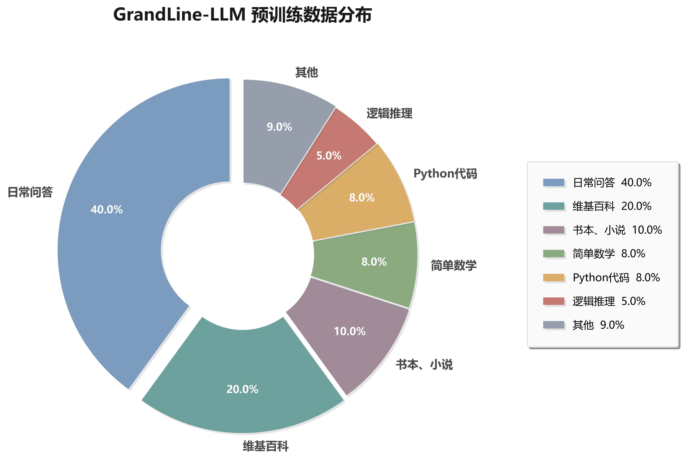

### 训练数据示例
<details>
<summary>点击查看数据样例 (Pre-train / SFT)</summary>

**预训练 (Pre-train) 数据示例:**
```json
{"text": "建议公司如何降低成本和提高效率。 1. 自动化和数字化：采用现代化技术和工具，例如自动化生产线和数字化软件，可 以降低公司的成本并提高效率。\n2. 减少浪费：公司应该削减浪费和不必要的支出，例如，纸质文档应该被数字文档所取代，减少生产过程中的浪费，比如回收再利用废料、采用环保的物料等。\n3. 精简流程：在生产过程中，公司可以采用精简流程的方法，有效地减少不必要的环节和流程，例如，简化审批流程，减少组织层级等。\n4. 节约能源：公司可以通过节约能源的方式降低成本，例如，减少非必要的照明、使用节能器材等。\n5. 优化供应链：优化供应链可以降低成本和提高效率，例如，与可信任的供应商合作，选择合适的运输方式，以及优化库存管理等。\n6. 培训员工：公司可以通过培训员工，提高员工素质和技能，增强员工的工作效率和生产力。\n7. 客户关系：与良好的客户关系可以提高公司的收入，例如，加强客户服务，提供有效的营销方案，以及满足客户需求等。\n总之，公司可以采取多种方法来降低成本和提高效率，但最关键的是要制定合理的计划和有效的策略，并实施科学的方案，以达到预 期的目标。"}
```

**指令微调 (SFT) 数据示例:**
```json
{"conversations": [
  {"content": "描述一个自然景观的美丽和神秘之处。", "role": "user"}, 
  {"content": "远离城市的喧嚣，在一片静谧的自然中心里，就能找到一个美丽而神秘的自然景观。那里有壮观的瀑布、茂密的森林、纯净的溪流和广阔的草原，它们有 着若干的奥秘，让人心生向往。在这个自然景观中，每一个细节都展现着上帝的魔幻艺术。阳光透过茂密的树叶，投射着温柔的光芒 ，在林间跳舞，给森林带来了充沛的生命之力，让它充满了生机。沿着河流缓缓走过，感受潺潺流水的声音，看那些石头在河水中闪 烁着光芒，犹如美丽的群舞一样，与周围的景色相互映衬着。或许最引人入胜的是那座壮观的瀑布，它气势磅礴，宛如天降飞瀑。瀑 布的水流中包含了岁月的沧桑，其中蕴含着神秘的传说。在瀑布下面，空气中弥漫着水雾的清香味，给人带来无与伦比的感官体验。 站在瀑布下面，片刻之间就能感受到自然界的伟大力量，深深地感受到了人与大自然的交融。美丽和神秘之处不仅仅停留于景观之中 ，更是在自然的故事中体现。这些景观只是自然里的一个结晶物，还隐藏着无数的秘密和神话传说，让人越来越向往和钦佩。总之， 这个自然景观的美丽和神秘之处无处不在，令人流连忘返，令人心神荡漾。它让人们真正领略到了大自然深邃的魅力，感受到了人与 自然不可分割的紧密联系。", "role": "assistant"}]}
```

**思维链蒸馏 (CoT Distill) 数据示例:**
```json
{"conversations": [
  {"role": "user", "content": "请描述一下“晨曦”给人的感觉。"}, 
  {"role": "assistant", "content": "<think>\n
  好，用户让我描述“晨曦”给人的感觉。我需要先理解“晨曦”是什么样的时间，还有它的影响。早上通常比较宁静，但可能还有 一些情绪上的波动，比如宁静又带有丝iness。\n\n接下来，考虑“晨曦”的视觉，比如阳光刚刚升起，衣服、家具可能都显得鲜活有力。同时，带着一丝柔和的感觉，给人一种温暖的感觉，但又不是过于轻盈。\n\n然后，思考“晨曦”背后的感受，可能带有宁静、安详 或者深藏的意味，这样才有层次感。同时，晨曦还能让人联想到清晨的故事，或者静谧的场景，这样的联想会让描述更生动。\n\n另 外，结构上可以用过去时态，描绘时间线，从清晨开始，阳光升起，阳光足够大地，以及微风带来的温暖感觉。这样层次分明，内容 全面。\n\n还要注意用词要细腻，比如“轻盈”、“倔强”、“温柔”、“宁静”、“安详”等，这些词汇能更好地传达出晨曦的特质。\n\n最 后，检查整个描述是否流畅，是否有遗漏的部分。确保涵盖视觉、触觉、嗅觉等多重感觉，让读者能够感受到晨曦的不同方面。\n
  </think>\n
  晨曦是一个充满宁静感和生机感的时间，给人以不同的感受和体验。它通常出现在清晨，阳光刚刚升起，空气中弥漫着清新的气息。这时候，万物都显得格外活泼，脸上也带着一丝轻盈和倔强。晨曦是一种温柔但又带着一丝不安的温暖，仿佛在向人们诉说着 一个静谧而安详的故事。它让人想起清晨的宁静时光，那些似乎永远也无法忘怀的宁静时刻。晨曦不仅是一种环境的温暖，更是一种 精神的慰藉，让人在不经意间感受到内心的宁静与安详。"}]}
```

**强化学习 (RL) 数据示例:**
```json
{"id": 174, "category": "指令与逻辑", "prompt": "写一个关于狗的句子。"}
```
</details>

---

<br>

## 📈 训练管线与收敛分析 (Training Pipeline & Metrics)

本项目在全周期训练链路中进行了严格的指标监控与可视化分析，确保模型在各阶段均能稳定收敛并获得预期的能力提升。

### 🔵 Dense 架构模型 (0.087B)

#### 1. 预训练阶段 (Pre-training)
在该阶段，模型通过大规模无监督语料进行 Next-Token Prediction 训练，旨在构建底层语言模型的通用语法结构认知、词汇关联与基础世界知识体系。
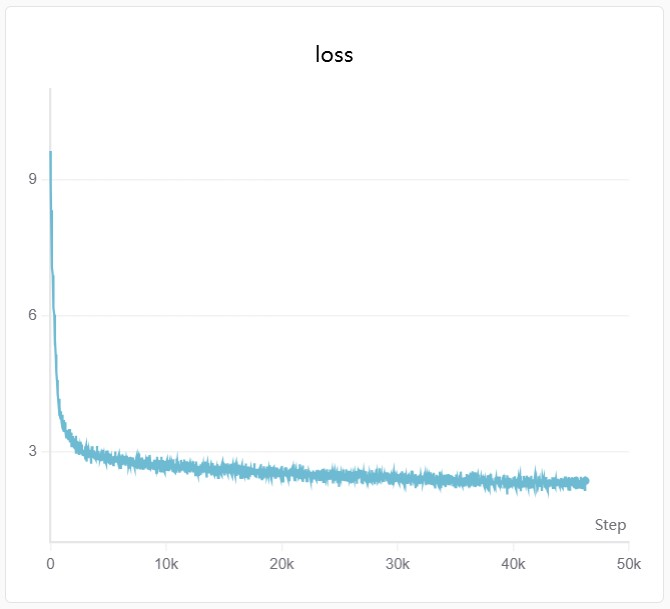

#### 2. 指令微调阶段 (Supervised Fine-Tuning)
通过注入高质量的问答对与结构化指令数据进行全参数微调。此阶段主要激发模型的指令遵循能力与多轮对话格式对齐。
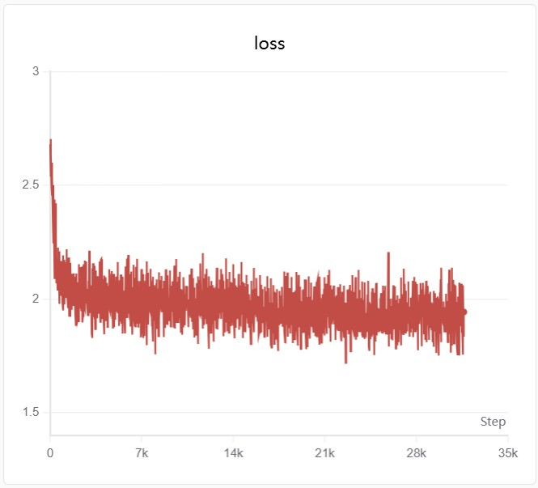

#### 3. CoT 思维链蒸馏 (Chain-of-Thought Distillation)
为弥补小参数模型原生推理能力的不足，本阶段引入了由顶尖前沿大模型生成的思维链（`<think>...</think>`）数据。通过将复杂的推理拆解能力“蒸馏”给本项目模型，使其在作答复杂问题时具备了“先思考逻辑、后输出结论”的惯性特征。
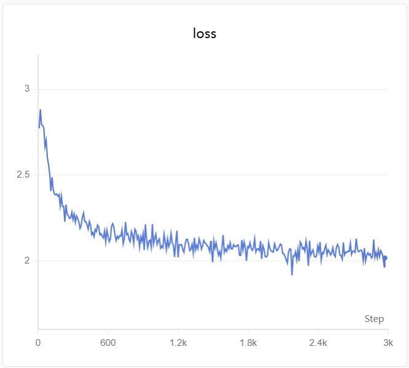

#### 4. RL 对齐阶段 (GRPO)
在模型具备基础指令遵循与初步推理能力后，本项目引入了**组相对策略优化 (Group Relative Policy Optimization, GRPO)** 进行人类偏好对齐。与传统依赖 Critic 网络的 PPO 不同，GRPO 显著降低了显存开销，极度契合轻量级模型的强化学习需求。
本阶段设计了**启发式规则与 LLM-as-a-Judge 混合驱动的复合奖励机制**：
- **格式约束奖励**：通过严格的正则匹配，强制模型输出标准化的高质量 CoT（`<think>`）思维链格式。
- **多维语义奖励**：引入前沿大模型作为 Reward Model，从“**语法流畅度 (Fluency)**”、“**事实准确性 (Factuality)**”与“**指令遵从度 (Instruction Following)**”三个核心维度对生成质量进行评判。
通过最大化复合反馈收益，该阶段不仅有效抑制了小参数模型固有的“幻觉 (Hallucination)”问题，更进一步提升了其回复的逻辑深度与人类偏好契合度。

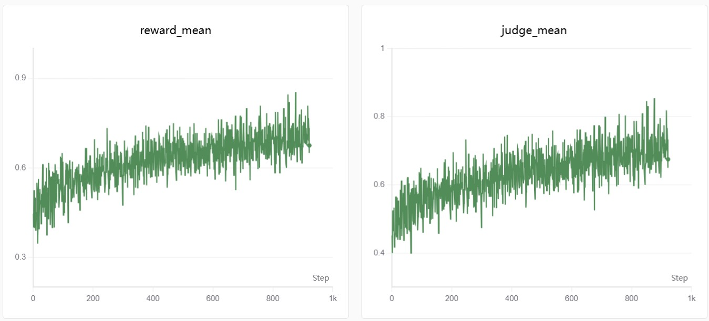
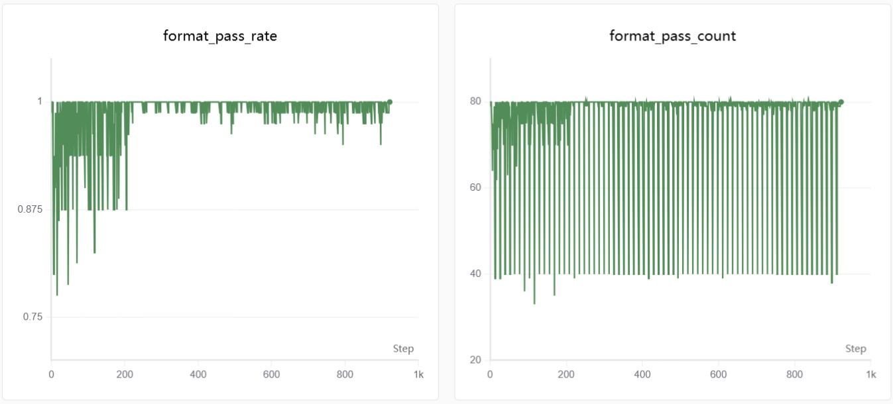
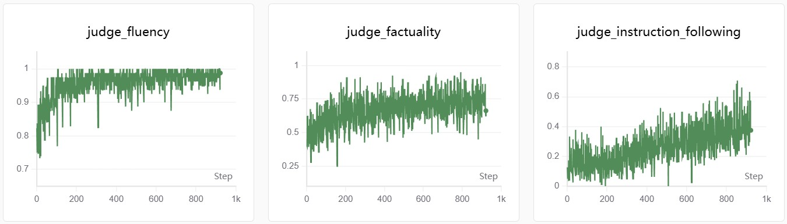
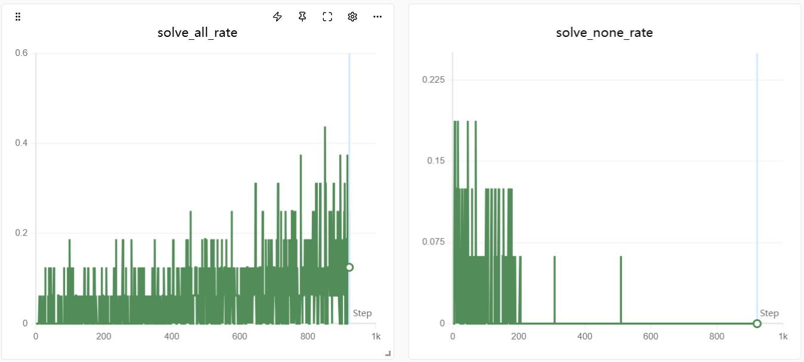
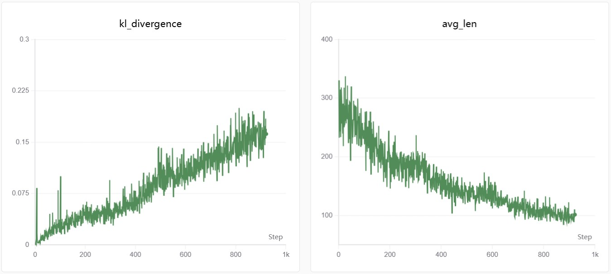

**训练结果分析**：
量化指标表明，经过 GRPO 本地组相对策略优化后，模型在格式遵循与文本连贯性上展现出极高的收敛度：CoT 推理范式掌握率（Format Reward）达到 **0.99**，语法流畅度（Fluency）接近物理极限收敛至 **0.985**。然而，受限于 0.08B 极小参数规模的固有知识容量（Knowledge Capacity）瓶颈，事实准确性（Factuality）与指令遵循度（Instruction Following）的收敛上界分别停靠在 **0.73** 和 **0.35** 左右，全局平均期望奖励（Mean Reward）稳定在 **0.68** 区间。

**策略退化与 Reward Hacking 现象观察**：
在长尾迭代的定性评测中，我们观察到模型出现了强化学习中经典的 **Reward Hacking（奖励欺骗）** 现象。为了过度迎合 Reward Model 对“友好度与流畅性”的隐性偏好，模型在后期迭代中逐渐演化出一种防御性的话术策略：倾向于输出极度礼貌的套话，甚至通过高频反问用户来规避正面作答，导致实际的信息熵下降。
基于上述对齐税（Alignment Tax）与策略退化的考量，本项目最终采取 Early Stopping 策略，截取 **Step 800** 的 Checkpoint 作为 GRPO 阶段的最佳可用模型（Best-Available Model），以求在 CoT 推理能力与实质性内容输出之间取得最佳平衡。

---

### 🟠 MoE 架构模型 (0.257B)
> **[TODO: 将在此处补充 MoE 模型的训练流水线、Loss 收敛图表与相应的训练策略分析]**

---

<br>

## ⚖️ 评测结果与生成示例 (Evaluation & Generation)

模型不仅通过了传统的 NLP 基础 Benchmark 测试，同时记录了各阶段的真实输出作为定性参考。以下展示了模型在全链路各节点的能力演进过程：

### 🔵 Dense 架构模型表现

#### 1. 预训练阶段 (Pre-training)
本阶段主要评估模型的基础文本困惑度 (Perplexity) 以及文本续写能力，验证其对中文语法和基础知识的掌握。
- **C3 & XCOPA Benchmark 测试结果**:
  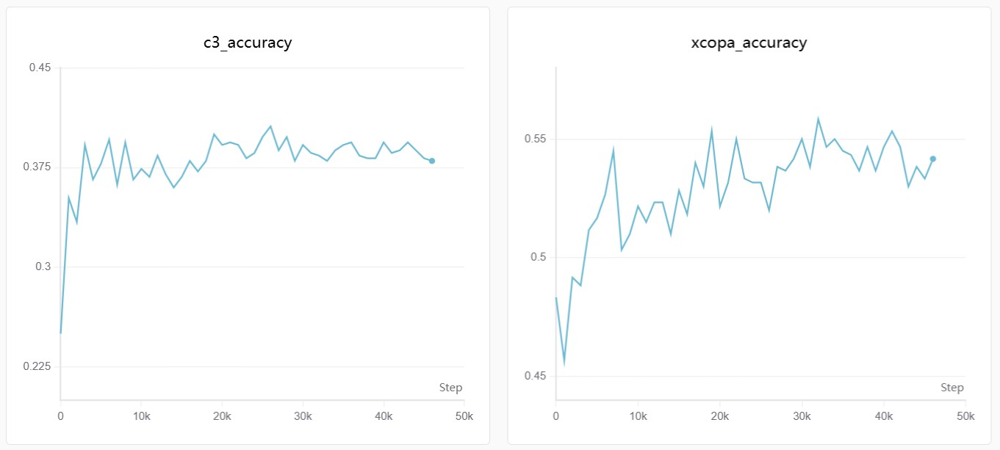
- **文本生成示例**:
  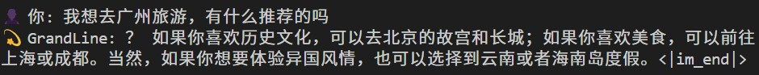

#### 2. 指令微调阶段 (Supervised Fine-Tuning)
本阶段引入了前沿的 LLM-as-a-Judge 自动化评测范式，从语法流畅度、事实准确性与指令遵从度三个核心维度对模型输出进行多维量化评估。这不仅深刻校验了 SFT 阶段的意图对齐效果，同时也为后续强化学习的奖励建模与策略优化探明了基准潜力。
- **LLM as Judge 测试结果**:
  
  量化分析表明，在流畅性、事实性与指令遵从度这三项核心评价指标上，模型的平均生成质量 (Average Score) 与 Best-of-N (Bo3) 采样的最优生成边界之间，稳定存在 0.15 至 0.20 的得分域差异 (Gap)。这一显著分歧揭示了模型当前策略尚未收敛至最优解，具备可观的偏好对齐与强化学习升维潜力。
  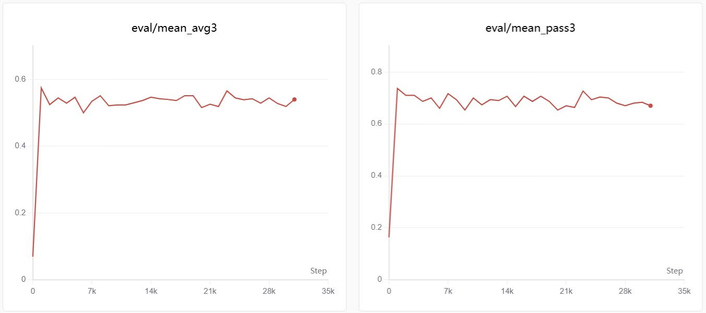
  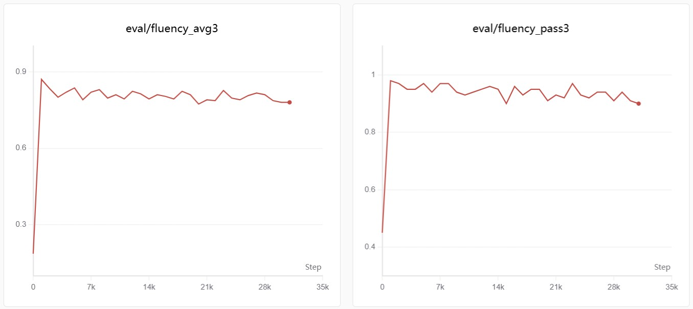
  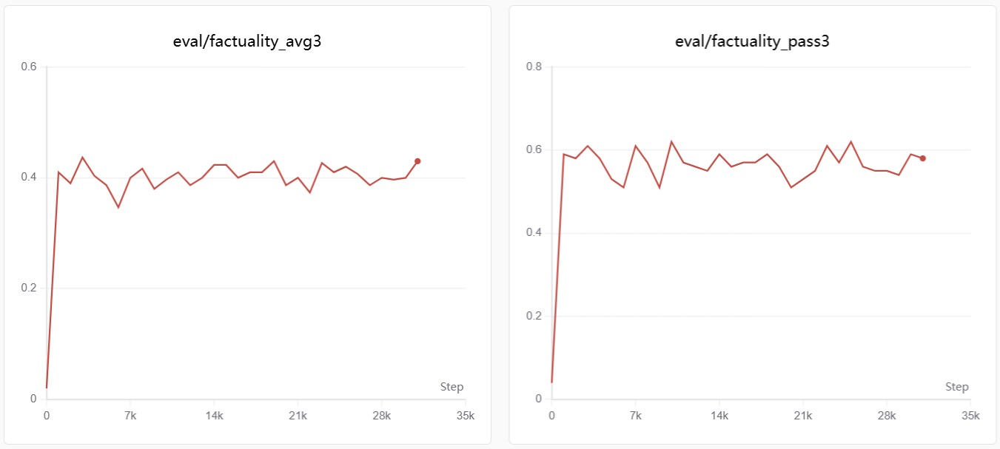
  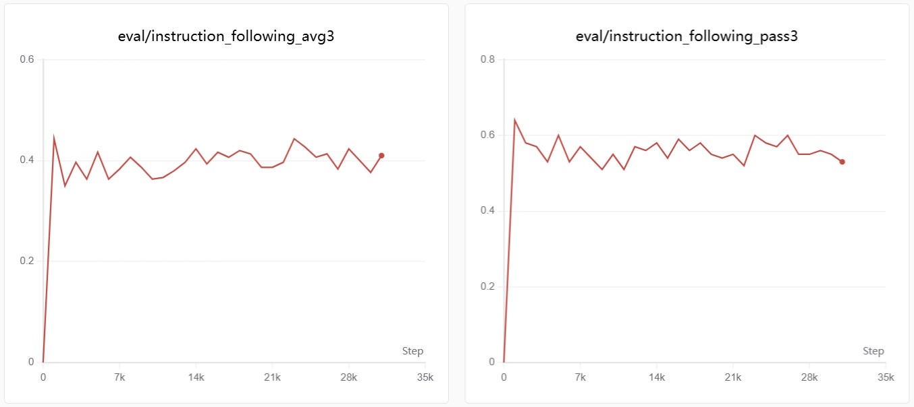
- **对话生成示例**:
  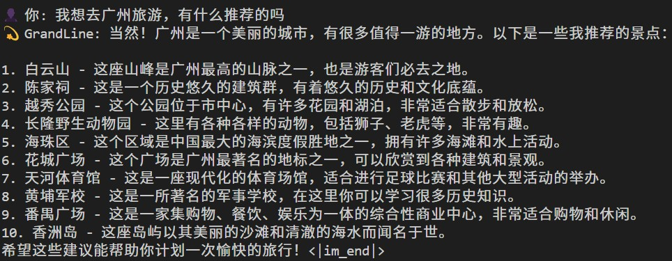

#### 3. CoT 思维链蒸馏 (Chain-of-Thought Distillation)
本阶段重点评估模型在面对复杂逻辑推理问题时的拆解能力，关注 `<think>` 标签内隐式推理过程的有效性。
- **推理生成示例**:
  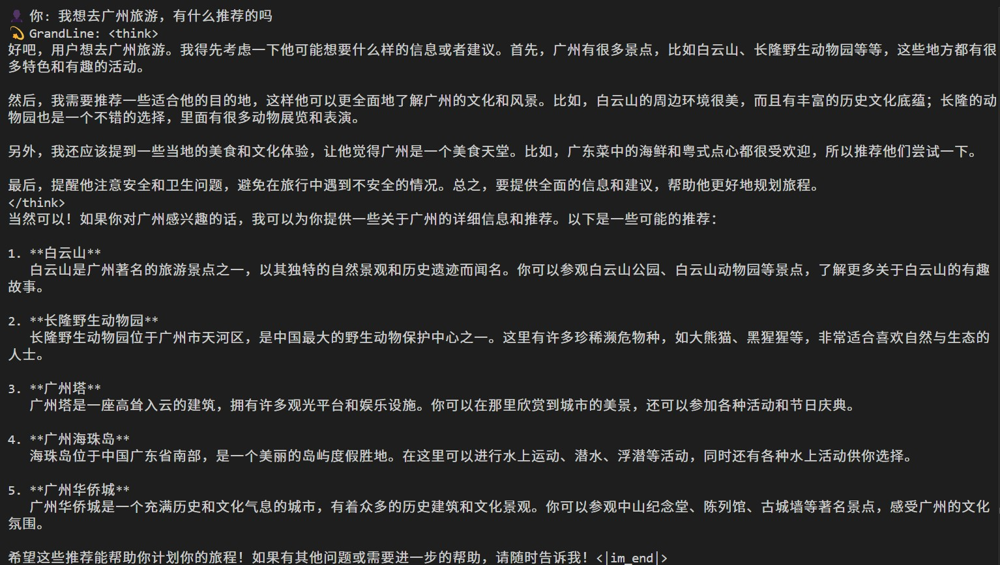

#### 4. RL 对齐阶段 (GRPO)
引入前沿大模型进行 LLM-as-a-Judge 自动化评估打分（综合考量语法流畅度、事实真实性和指令遵循度），并验证模型幻觉抑制的效果。
  
- **对齐生成示例**:
  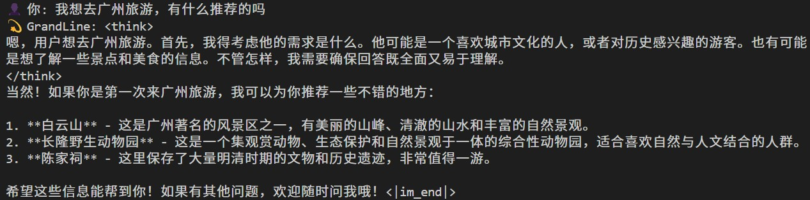

---

### 🟠 MoE 架构模型表现
> **[TODO: 将在此处补充 MoE 模型在各指标下的 Benchmark 打分，以及其在多专家调度下的实际生成用例比对]**

---

<br>

## 📂 目录结构 (Directory Structure)

```text
GrandLine_LLM/
├── benchmark/                      # 自动化评测管线与 Benchmark 数据集
│   ├── mini_bench/                 # 自定义指令遵循 (SFT) 评测模块
│   │   ├── 100_mini_prompt.jsonl   # 标准化评测 Prompt 数据集
│   │   └── eval.py                 # 基于 LLM-as-a-Judge 的对话质量评估脚本
│   └── evaluator.py                # 标准客观题 (如 C3, XCOPA) 准确率测试脚本
├── data/                           # 物理数据存储与语料库
│   └── rl_data/                    # 强化学习 (GRPO/RLHF) 偏好对齐语料
├── dataset/                        # 数据加载器与预处理流水线
│   ├── preprocess_data.py          # 预训练语料的高效清洗与 Tokenize 预处理脚本
│   ├── pretrain_dataset.py         # Pre-training 阶段 PyTorch Dataset 封装
│   ├── sft_dataset.py              # Supervised Fine-Tuning 指令包装与 Dataset 实现
│   └── grpo_dataset.py             # 强化学习阶段生成与奖励计算所需 Dataset 封装
├── model/                          # 模型基础架构原生实现
│   ├── config.py                   # GrandLine 模型总体架构的超参数配置定义
│   └── model_grandline.py          # Decoder-only 核心实现 (手动实现 RoPE, GQA, SwiGLU, KV Cache 等)
├── tokenizer_15k/                  # 自训练 BBPE (Byte-Level BPE) 分词器产物库
│   ├── tokenizer.json              # 底层词表定义与 BPE Merge 规则集合
│   └── tokenizer_config.json       # HuggingFace 兼容的分词器元信息配置文件
├── train/                          # 模型训练生命周期管理与启动脚本
│   ├── pretrain.py                 # 分布式预训练主干逻辑 (DDP并行, 自动断点续训, 余弦退火)
│   ├── pretrain_without_ddp.py     # 单卡预训练基线实现 (用于调试或资源受限场景)
│   ├── train_sft.py                # 全参数指令微调训练流程控制
│   ├── train_grpo.py               # 原生手写的 GRPO (Group Relative Policy Optimization) 强化学习脚本
│   ├── train_tokenizer.py          # 基于自建语料域的 BPE 词表训练构建脚本
│   └── utils.py                    # 训练通用的基础设施与工具函数 (I/O, Logging, Checkpointing)
├── eval.py                         # 基于控制台的终端对话推理与模型快速测试入口
├── requirements.txt                # 项目运行环境声明与 Python 依赖清单
└── README.md                       # 项目使用手册与技术文档
```

---

<br>

## 📦 模型权重下载 (Downloads)

模型权重已分别托管至 **Hugging Face** 与 **ModelScope (魔搭社区)**，您可以根据网络环境选择任意一个平台下载体验：

### 📌 方式一：从 Hugging Face 下载
```bash
pip install huggingface_hub
huggingface-cli download JustinLeee/GrandLine_LLM --include "dense/*" --local-dir ./model_weight
```

### 📌 方式二：从 ModelScope 下载 (国内推荐)
```bash
pip install modelscope
modelscope download --model JustinLeee/GrandLine_LLM --include "dense/*" --local_dir ./model_weight
```

---

<br>

## 🚀 快速开始 (Quick Start)

### 环境安装
```bash
git clone https://github.com/Justin-ljw/GrandLine_LLM.git
cd GrandLine_LLM
pip install -r requirements.txt
```

### 快速对话测试
只需要通过项目内的 `eval.py` 脚本，并将模型权重文件路径传入 `model_path` 参数即可直接开始对话：
```bash
python eval.py --model_path model_weight/dense/grpo_768.pth
```

### 模型训练启动命令 (Training Commands)
```bash
cd train\
```

**1. DDP 分布式预训练 (Distributed Pre-training)**

使用 `torchrun` 启动多卡并行预训练（以 4 卡为例）：
```bash
torchrun --nproc_per_node=4 pretrain.py --data_path "YOUR_PRETRAIN_DATA_PATH" 
```

**2. 单卡预训练 (Single-GPU Pre-training)** 

针对资源受限或代码调试场景，可使用单卡基线版本：
```bash
python pretrain_without_ddp.py --data_path "YOUR_PRETRAIN_DATA_PATH" 
```

**3. 指令微调 (Supervised Fine-Tuning, SFT)**

启动 SFT 训练须基于预训练模型的权重。请指定 --model_path，如需激活内置的大模型自动化评测管线，则需同传 --api_key：
```bash
python train_sft.py --from_weight "model_weight/dense/pretrain_768.pth" --data_path "YOUR_SFT_DATA_PATH" --judge_api_key "YOUR_API_KEY" --judge_model "deepseek-chat"
```

**4. 思维链蒸馏 (Chain-of-Thought Distillation)**

本阶段复用 SFT 的训练脚本。继承 SFT 阶段的模型权重，并注入由前沿大模型生成的详尽思维链数据（包含 <think> 标签），无需开启在线评测：
```bash
python train_sft.py --from_weight "model_weight/dense/sft_768.pth" --data_path "YOUR_COT_DATA_PATH" --eval_bench 0
```

**5. 强化学习对齐 (GRPO)**

启动 GRPO 训练需继承上一阶段（蒸馏或 SFT）的权重。由于本项目采用了 LLM-as-a-Judge 奖励模型，必须传入有效的前沿大模型 API Key（用于计算文本生成维度的评测奖励得分）：
```bash
python train_grpo.py --sft_model_path "model_weight/dense/thinking_distill_768.pth" --data_path "YOUR_GRPO_DATA_PATH" --judge_api_key "YOUR_API_KEY" --judge_model "deepseek-chat"
```

---

<br>

## ⚠️ 局限性与免责声明 (Limitations)

**1.知识容量限制**：受限于极小的参数规模（不到 100M），模型内部能够存储的世界知识非常有限。强依赖大量记忆的事实性问答可能会发生“幻觉（Hallucination）”。

**2.定位与用途**：本模型旨在用作学术研究、教育学习及 LLM 管线跑通论证，不具备处理复杂生产任务与高精度商业部署的能力。

---

<br>

## 📄 License
本项目基于 MIT 开源许可证发布，更多详细信息请参阅 [LICENSE](LICENSE) 文件。
